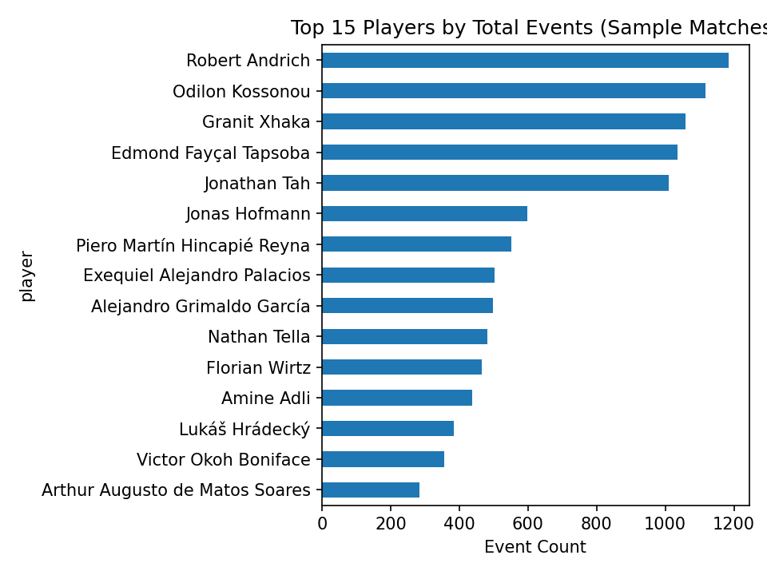
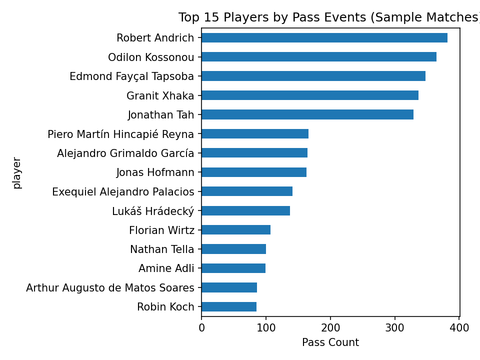

# Soccer Performance Analytics Platform ⚽

A data + analytics project that ingests soccer datasets, cleans and normalizes them, and produces player/team performance insights.

## MVP Goals
- Ingest a public soccer dataset
- Clean/normalize data into analysis-ready tables
- Compute core performance metrics (minutes, trends, consistency)
- Produce a simple notebook with insights

## Repo Structure
- `data/raw/` - raw downloaded data
- `data/processed/` - cleaned outputs (CSV/Parquet)
- `notebooks/` - analysis + charts
- `src/` - ingestion, transforms, analytics modules
- `reports/` - exported charts / summaries

## Early Insights (StatsBomb Sample)

### Top Players by Total Events

### Top Players by Pass Events

# Soccer Performance Analytics Platform ⚽

A lightweight analytics platform that ingests real-world soccer event data, transforms it into analysis-ready tables, and produces player-level performance insights and visualizations.

This project demonstrates an end-to-end data workflow: **raw ingestion → transformation → analysis → reporting**.

---

## Project Goals (MVP)

- Ingest a public soccer dataset (StatsBomb Open Data)
- Normalize nested JSON into flat, analysis-ready tables
- Perform exploratory player-level analysis
- Generate visual artifacts suitable for reporting and dashboards

---

## Data Pipeline Overview

1. **Ingestion**
   - Download raw StatsBomb match event JSON files
   - Store data in a versioned raw data directory

2. **Transformation**
   - Flatten deeply nested event JSON into tabular format
   - Inject missing metadata (e.g., match_id from filenames)
   - Export clean datasets as CSV and Parquet

3. **Analysis**
   - Aggregate player activity metrics
   - Perform event-level and spatial (pitch) analysis
   - Explore per-player involvement and tendencies

4. **Reporting**
   - Generate charts and pitch maps
   - Save visual outputs as reusable artifacts

---

## Repository Structure

├── data/
│ ├── raw/ # Raw downloaded JSON data (not committed)
│ └── processed/ # Cleaned, analysis-ready datasets
├── src/
│ ├── ingest/ # Data ingestion scripts
│ └── transform/ # Data normalization / flattening logic
├── notebooks/ # Exploratory analysis and visualizations
├── reports/ # Exported charts and figures
├── README.md
└── requirements.txt

---

## Sample Insights (StatsBomb Open Data)

### Top Players by Total Event Involvement
Players with the highest number of on-ball actions across sampled matches.

---

### Top Players by Pass Volume
Distribution of pass activity by player.

---

## Skills Demonstrated

- Data ingestion and normalization
- Working with nested JSON at scale
- Reproducible analytics workflows
- Exploratory data analysis with Python
- Visualization and reporting
- GitHub project hygiene and structure

---

## Future Extensions (Optional)

- Per-match player dashboards
- Event-type heatmaps and pitch control visuals
- Team-level aggregation and comparisons
- Automated pipeline execution

---

## Data Source

- [StatsBomb Open Data](https://github.com/statsbomb/open-data)

---

*This project is intended for learning, portfolio, and demonstration purposes.*
